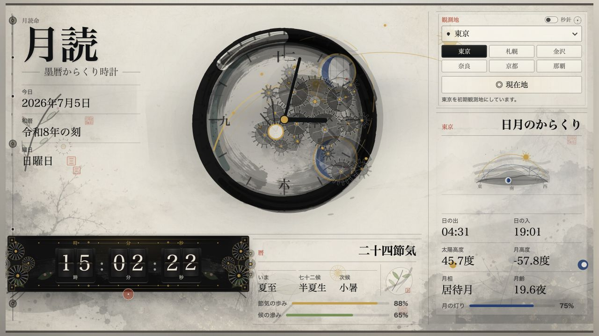

# 月読

**月読命 / 墨暦からくり時計** は、日本時間、日本の暦、太陽と月の位置を、水墨画風のからくり時計としてブラウザに描く静的フロントエンドアプリです。

English summary: Tsukuyomi is a Japanese ink-painting inspired astronomical karakuri clock for the browser.



## 作品概要

- 中央に墨の円相を思わせるアナログ時計を置き、時針、分針、歯車、小窓、月窓、太陽軌跡をSVGで描画します。
- アナログ時計の秒針は負荷を抑えるためデフォルト非表示です。右上の「秒針」トグルで必要な時だけ表示できます。
- 下段に上下札式のパタパタデジタル時計、左に日付/和暦風ラベル/曜日、右に日の出、日の入り、太陽高度、月高度、月相、月齢を表示します。
- 二十四節気と七十二候は、Astronomy Engineの太陽黄経探索と節気区間の三分割によるv1近似です。
- Canvasと薄いラスタ素材は、墨滲み、霧、粒子、筆筋、山水、月面、歯車影、和紙小窓、朱印、黒漆ケースの擦れの装飾レイヤーだけに使います。
- 時刻、暦、都市、天体値、設定などの意味情報はHTML/SVG/React stateにも保持します。

## 現在できること

- PCの現在日時を入力源にした日本時間の時計表示
- `Asia/Tokyo` 固定の西暦、和暦風ラベル、曜日表示
- 二十四節気、七十二候、節気/候の進捗表示
- SunCalcによる日の出、日の入り、太陽高度、月高度の表示
- Astronomy EngineとSunCalcによる月齢、月相、月の灯り表示
- 東京、京都、札幌、金沢、奈良、那覇の観測地プリセット
- ブラウザのGeolocation APIによる任意の現在地取得
- アナログ秒針の表示/非表示切り替え
- `?keiko=1` の隠し稽古パネルによる固定時刻、速度、低モーション、演出シナリオ再現

## 技術構成

- Vite
- React
- TypeScript
- SVG
- CSS
- Canvas
- GSAP
- SunCalc
- Astronomy Engine

`Three.js`、`D3.js`、`p5.js` はv1依存には含めていません。将来の3D地球儀、星図、生成的な筆表現の候補として設計上だけ残しています。

## 起動方法

```bash
npm install
npm run dev -- --port 3000
```

Viteが指定ポートを使えない場合は、表示された代替URLを使ってください。

## 表示URL

- 通常表示: `/`
- 稽古パネル: `/?keiko=1`
- 固定時刻と低モーション確認: `/?keiko=1&at=2026-07-05T06:30:00%2B09:00&speed=60&play=0&motion=reduce`

稽古パネルは制作/QA用の隠し機能です。`?keiko=1` がない通常表示ではDOMにも出しません。

## 操作

- 観測地: 右上のセレクトまたはプリセットボタンで切り替えます。
- 現在地: ブラウザの位置情報許可を使います。拒否、未対応、タイムアウト時は東京に戻します。逆ジオコーディングはしません。
- 秒針: 右上の「秒針」トグルで、アナログ時計の秒針だけを表示/非表示にします。デジタル時計の秒表示は常時表示です。
- 低モーション: 端末の `prefers-reduced-motion` と稽古パネルの `motion` パラメータを尊重します。

## 稽古パネル

稽古パネルでは、以下をブラウザ上で再現できます。

- 現在へ戻す
- 再生/停止
- `±1秒`、`±1分`、`±1時間`、`±1日`
- 再生速度 `x1`、`x60`、`x3600`
- 低モーションの `端末設定`、`低モーション`、`演出全開`
- 分歯車、毎時小窓、日付落款、節気滲み、候滲み、月齢窓

## 検証コマンド

```bash
npm run typecheck
npm test
npm run build
npm run check
```

`npm run check` は `typecheck`、`test`、`build` を一括で実行します。手動QAの観点は [docs/QA.md](docs/QA.md) に記録しています。

## スクリーンショット更新

READMEのスクリーンショットは `docs/images/tsukuyomi-clock.jpg` です。更新する時は通常表示 `/` を1280x720で開き、アナログ秒針が非表示のデフォルト状態を撮影します。

## v1の範囲

バックエンド、ログイン、DB、天気API、多言語対応、世界都市対応、3D地球儀、厳密な公的旧暦計算は含めていません。
